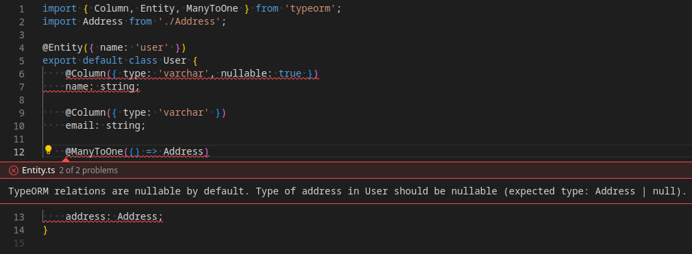

# TypeORM-TypeScript ESLint Plugin

An ESLint plugin to catch mistakes if the TypeORM column types and TypeScript types aren't consistent.



## Installation

Install the package for the plugin:

```sh
npm install -D eslint-plugin-typeorm-typescript
```

### Flat configuration

To enable all rules, add the recommended configuration for `eslint-plugin-typeorm-typescript` to `eslint.config.mjs`:

```js
import eslint from '@eslint/js';
import tseslint from 'typescript-eslint';
import typeormTypescriptRecommended from 'eslint-plugin-typeorm-typescript/recommended';

export default tseslint.config(
  eslint.configs.recommended,
  ...tseslint.configs.recommended,
  typeormTypescriptRecommended,
);
```

If you want to change the options, enable the plugin and the rules manually:

```js
import eslint from '@eslint/js';
import tseslint from 'typescript-eslint';
import typeormTypescriptPlugin from 'eslint-plugin-typeorm-typescript';

export default tseslint.config(
  eslint.configs.recommended,
  ...tseslint.configs.recommended,
  {
    plugins: {'typeorm-typescript': typeormTypescriptPlugin},
    rules: {
      "typeorm-typescript/enforce-column-types": "error",
      "typeorm-typescript/enforce-relation-types": "warn",
      "typeorm-typescript/enforce-consistent-nullability": ["error", { "specifyNullable": "always" }]
    }
  }
);
```

For more information, see an example of the [recommended configuration](./examples/recommended/) or the [customized configuration](./examples/customized/).

### Legacy configuration

If you are still on legacy ESLint, update `.eslintrc.json` with the plugin to the `plugins` key, and add it to the `rules`:

```json
{
  "plugins": ["typeorm-typescript"],
  "rules": {
    "typeorm-typescript/enforce-column-types": "error",
    "typeorm-typescript/enforce-relation-types": "error",
    "typeorm-typescript/enforce-consistent-nullability": "error"
  }
}
```

For more information, see an example of the [legacy configuration](./examples/legacy/).

## Rules

TypeORM has no way to statically analyze if there is an inconsistency in the annotated TypeScript types.
With the addition, that there are some confusing rules around nullability (relations are nullable by default,
but columns aren't), it makes it easy to make mistakes. These ESLint rules will spot these issues, and suggest fixes.

### typeorm-typescript/enforce-column-types

TypeORM data types and TypeScript types should be consistent. It checks the primitive types (e.g. `VARCHAR` -> `string`)
and driver-specific types. By most drivers, `bigint` and `decimal` are parsed as string, except in SQLite (set the `driver`
option, if you use SQLite). This rule checks the nullability too: by default columns are non-nullable, but if the `nullable: true`
option is set, it should be unioned with `null` in the TypeScript types as well.

It also handle primary columns (`number` by default), create and update columns (`date` by default) and delete columns
(`date` and nullable by default).

#### Configuration

```json
{
  "rules": {
    "typeorm-typescript/enforce-column-types": "error",
    // If you are using SQLite, set the driver
    "typeorm-typescript/enforce-relation-types": ["error", { "driver": "sqlite" }],
  }
}
```

#### Examples

Examples of **incorrect code** for this rule:

```ts
class Entity {
    // Should be string
    @Column({ type: "varchar" })
    name: number;

    // Should be string | null
    @Column({ type: "varchar", nullable: true })
    name: string;

    // Should be Date | null
    @DeleteDateColumn()
    deletedAt: Date;
}
```

Examples of **correct code** for this rule:

```ts
class Entity {
    // TypeORM data type and TypeScript type are consistent
    @Column({ type: "varchar" })
    name: string;

    // Nullability is correct
    @Column({ type: "varchar", nullable: true })
    name: string | null;
}
```

### typeorm-typescript/enforce-relation-types

TypeORM relation types and TypeScript types should be consistent. Because the names are similar, it can be easily confused
that `ManyToOne` should be singular, and `OneToMany` an array. Additionally, `OneToOne` and `ManyToOne` are nullable,
which is an easy mistake to make.

This rule also supports the [ESM Relation wrapper](https://typeorm.io/#relations-in-esm-projects). If you are using ES Modules
and want to avoid circular dependency issues, you can set `specifyRelation` to always to make sure that relations are always
wrapped with `Relation<...>`.

#### Configuration

```json
{
  "rules": {
    "typeorm-typescript/enforce-relation-types": "error",
    // If you want to force setting Relation<...> everywhere
    "typeorm-typescript/enforce-relation-types": ["error", { "specifyRelation": "always" }],
  }
}
```

#### Examples

Examples of **incorrect code** for this rule:

```ts
class Entity {
    // Should be Other | null
    @OneToOne(() => Other)
    @JoinColumn()
    other: Other;

    // Should be Other[]
    @OneToMany(() => Other, (other) => other.entity)
    other: Other;

    // Should be Other | null
    @ManyToOne(() => Other)
    other: Other;

    // Should be Other[]
    @ManyToMany(() => Other)
    @JoinTable()
    other: Other;

    // Should be Other | null
    @OneToOne(() => Other)
    @JoinColumn()
    other: Another | null;
}
```

Examples of **correct code** for this rule:

```ts
class Entity {
    // Join is correctly nullable...
    @OneToOne(() => Other)
    @JoinColumn()
    other: Other | null;

    // ...or explicitly marked nullable: false
    @OneToOne(() => Other, { nullable: false })
    @JoinColumn()
    other: Other;

    // *ToMany rules are an array
    @OneToMany(() => Other, (other) => other.entity)
    others: Other[];
}
```

### typeorm-typescript/enforce-consistent-nullability

The main source of confusion with TypeORM decorators is that the `nullable` flag is different between columns and relations.
It is further complicated by being able to set the default value in some places and omit from others. Enable this rule to make sure
that either only the non-default value is set (no parameters or `non-default`) or the nullable must be specified every time (`always`).

#### Configuration

```jsonc
{
    "rules": {
        // If you want to report an error for unnecessary nullables
        "typeorm-typescript/enforce-consistent-nullability": "error", // or
        "typeorm-typescript/enforce-consistent-nullability": ["error", { "specifyNullable": "non-default" }],
        // If you want to force setting nullable everywhere to avoid confusion
        "typeorm-typescript/enforce-consistent-nullability": ["error", { "specifyNullable": "always" }],
    },
}
```

#### Examples

Examples of **incorrect code** for this rule:

With `{ "specifyNullable": "non-default" }`:

```ts
class Entity {
    // Columns are non-nullable by default, remove it
    @Column({ type: "varchar", nullable: false })
    name: number;

    // Relations are nullable by default, remove it
    @OneToOne(() => Other, { nullable: true })
    @JoinColumn()
    other: Other | null;
}
```

With `{ "specifyNullable": "always" }`:

```ts
class Entity {
    // Mark this to nullable false to make it clear
    @Column({ type: "varchar" })
    name: number;

    // Mark this to nullable true to make it clear
    @OneToOne(() => Other)
    @JoinColumn()
    other: Other | null;
}
```

Examples of **correct code** for this rule:

With `{ "specifyNullable": "non-default" }`:

```ts
class Entity {
    // Nullability only defined when it is different than default
    @Column({ type: "varchar", nullable: true })
    middleName: number | null;

    @Column({ type: "varchar" })
    name: number;

    @OneToOne(() => Other)
    @JoinColumn()
    other: Other | null;
}
```

With `{ "specifyNullable": "always" }`:

```ts
class Entity {
    // Nullable is set everywhere, no default behaviour is implied
    @Column({ type: "varchar", nullable: true })
    middleName: number | null;

    @Column({ type: "varchar", nullable: false })
    name: number;

    @OneToOne(() => Other, { nullable: true })
    @JoinColumn()
    other: Other | null;
}
```
